# Implementación de Servidor NGINX + PHP-FPM Compilado desde Código Fuente

---

## Carátula

| Campo | Detalle |
|---|---|
| **Institución** | TECNOLÓGICO DE ESTUDIOS SUPERIORES DEL ORIENTE DEL ESTADO DE MEXICO |
| **Carrera** | INGENIERIA EN SISTEMAS COMPUTACIONALES |
| **Materia** | TALLER DE SISTEMAS OPERATIVOS |
| **Proyecto** | COMPILACION E INTEGRACIÓN DE NGINX 1.31.0 Y PHP 8.4.21 DESDE CÓDIGO FUENTE |
| **Docente** | GUSTAVO MOISES ROMERO GONZALEZ |
| **Grupo y Ciclo Escolar** | 6S21 / 2026-1 |
| **Fecha de entrega** | 26 de mayo de 2026 |

### Integrantes

| Nombre | Matrícula |
|---|---|
| HERNANDEZ HERNANDEZ ADRIEL | 236020042 |
| MARTINEZ ARVIZU KARLA ABRIL | 236020067 |


---

## Objetivo General

Instalar y configurar un servidor web NGINX 1.31.0 y un motor PHP 8.4.21, ambos compilados desde código fuente, integrándolos mediante el protocolo FastCGI con socket UNIX, y registrando ambos como servicios de systemd con arranque automático en `multi-user.target`.

---

## Objetivos Específicos

- Compilar NGINX 1.31.0 desde código fuente con prefix en `/srv/nginx`, usuario y grupo `nginx`.
- Registrar NGINX como servicio systemd en `/etc/systemd/system/nginx.service` con arranque automático.
- Compilar PHP 8.4.21 con soporte FPM, procesamiento de imágenes (`gd`), internacionalización (`intl`) y OPcache/JIT.
- Configurar PHP-FPM con socket UNIX `/tmp/php84.sock` para comunicarse con NGINX vía FastCGI.
- Registrar PHP-FPM como servicio systemd en `/etc/systemd/system/php-fpm8.4.service`.
- Instalar la extensión MongoDB vía PECL y validar todas las extensiones desde el navegador.

---

## Desarrollo del Proyecto

---

### 1. Instalación de dependencias para compilar NGINX

Antes de compilar, necesitamos las herramientas básicas de construcción y las bibliotecas de desarrollo. Cambiamos a root, navegamos al directorio de trabajo e instalamos:

```bash
su -
cd src
dnf install -y wget tar gcc make
dnf install -y zlib-devel openssl-devel pcre2-devel
```

- `gcc` — el compilador de C que transforma el código fuente en binarios ejecutables.
- `make` — coordina el proceso de compilación leyendo el `Makefile` generado por `./configure`.
- `zlib-devel`, `openssl-devel`, `pcre2-devel` — bibliotecas necesarias para compilar los módulos de compresión, HTTPS y expresiones regulares de NGINX.

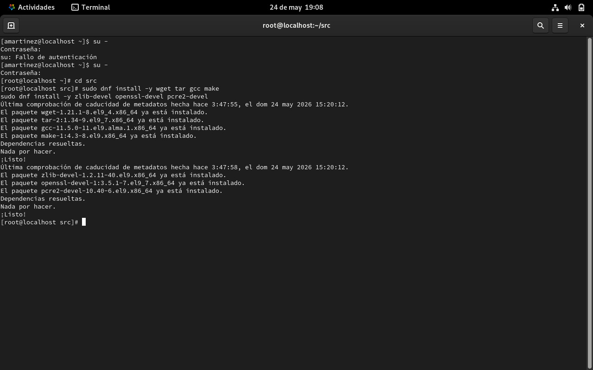
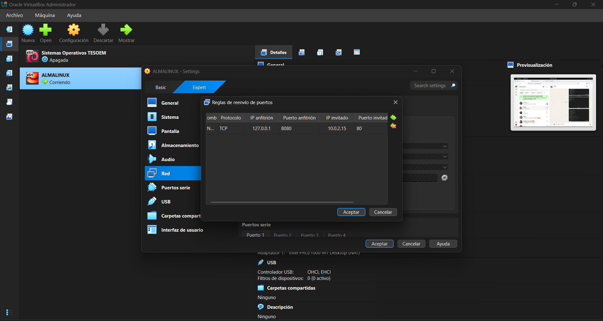

---

### 2. Descarga y extracción del tarball de NGINX 1.31.0

Descargamos el código fuente directamente desde el sitio oficial de NGINX y lo extraemos:

```bash
wget https://nginx.org/download/nginx-1.31.0.tar.gz
tar -xzvf nginx-1.31.0.tar.gz
cd nginx-1.31.0/
```

El archivo pesa aproximadamente 1.3 MB. Al extraerlo se genera el directorio `nginx-1.31.0/` con todo el código fuente, incluyendo `configure`, `src/`, `conf/` y `html/`.

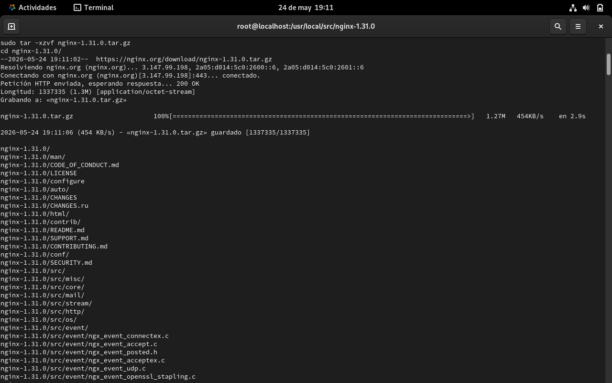
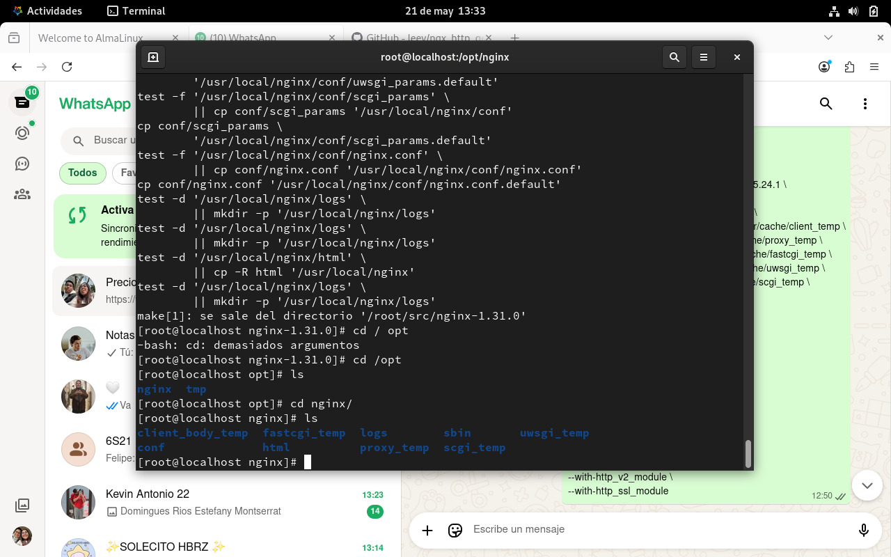

---

### 3. Ejecución de `./configure` — primer intento fallido y corrección

Antes de ejecutar el configure, creamos el usuario de sistema que correrá el proceso de NGINX:

```bash
useradd --system --no-create-home --shell /sbin/nologin nginx
```

Primer intento (con error):

```bash
./configure \
  --prefix=/srv/nginx \
  --user=nginx \
  --group=nginx \
  --with-http_ssl_module \
  --with-http_v2_module \
  --with-zlib \
  --with-pcre \
  --with-http_realip_module
```

El configure rechazó la opción `--with-zlib` porque en NGINX 1.31 esa opción se usa solo cuando se quiere compilar zlib de forma estática apuntando a sus fuentes, no para usar la del sistema. Se quitó el flag y se volvió a ejecutar correctamente.

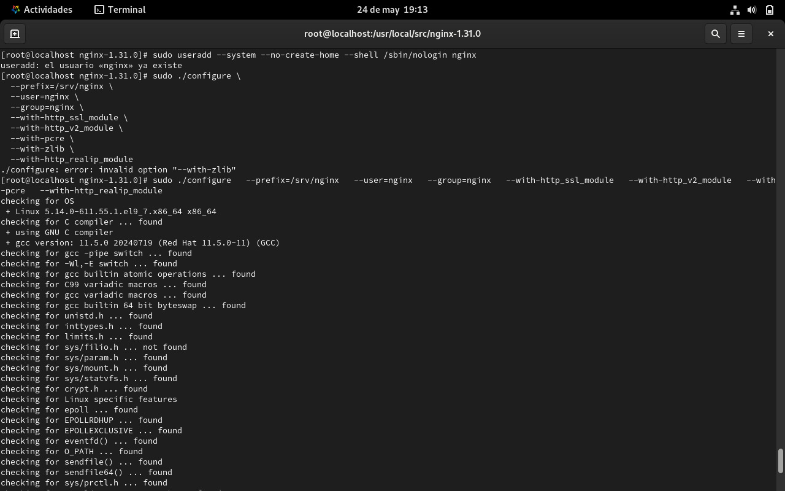
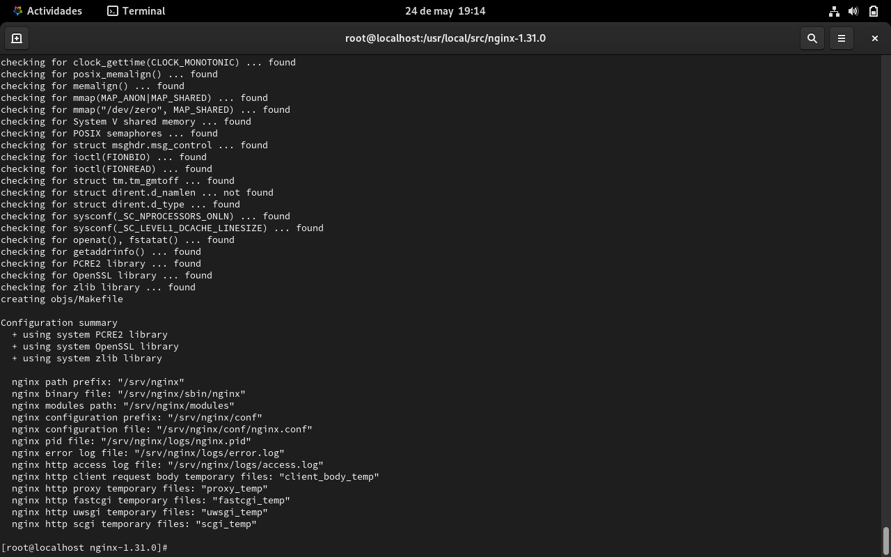

---

### 4. Resumen final del `./configure` de NGINX

Segunda ejecución del configure, ahora sin `--with-zlib`:

```bash
./configure \
  --prefix=/srv/nginx \
  --user=nginx \
  --group=nginx \
  --with-http_ssl_module \
  --with-http_v2_module \
  --with-pcre \
  --with-http_realip_module
```

El configure finalizó mostrando el resumen de detección del sistema: GCC 11.5.0, `using system PCRE2 library`, `using system OpenSSL library`, `using system zlib library`, y todas las rutas de instalación apuntando a `/srv/nginx`.

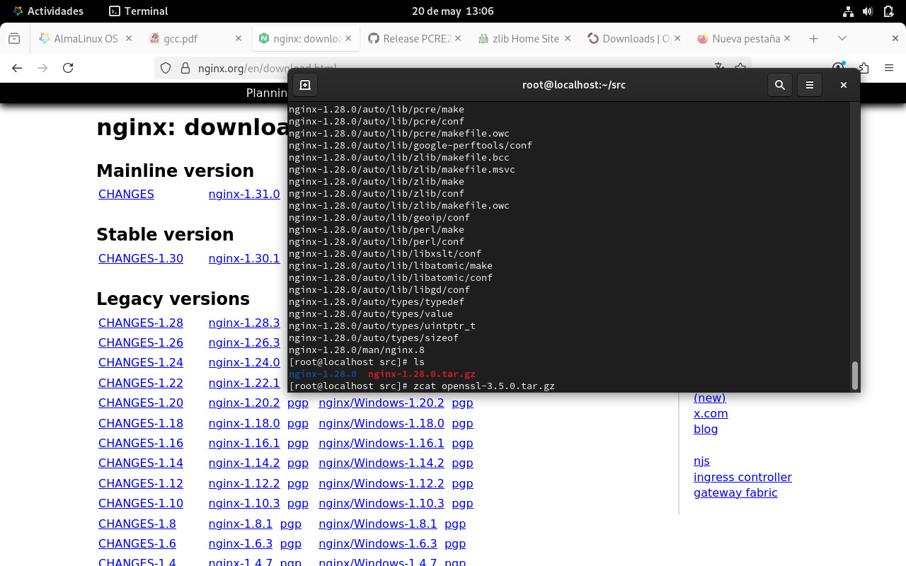
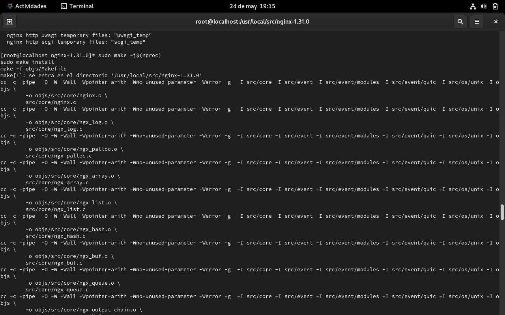

---

### 5. Compilación de NGINX con `make -j$(nproc)`

Con el `Makefile` generado, iniciamos la compilación usando todos los núcleos disponibles del procesador:

```bash
make -j$(nproc)
```

`$(nproc)` devuelve el número de núcleos disponibles y los usa todos en paralelo, reduciendo el tiempo de compilación. Durante el proceso se compilan todos los módulos del core de NGINX: `ngx_http_core_module`, `ngx_http_ssl_module`, `ngx_http_v2_module`, entre otros.


---

### 6. Instalación de NGINX con `make install`

Una vez terminada la compilación, instalamos los binarios en las rutas del prefix:

```bash
make install
```

Al finalizar, NGINX queda instalado en `/srv/nginx/` con la siguiente estructura:

```
/srv/nginx/sbin/nginx       ← binario principal
/srv/nginx/conf/nginx.conf  ← configuración principal
/srv/nginx/html/            ← directorio raíz por defecto
/srv/nginx/logs/            ← access.log, error.log, nginx.pid
```

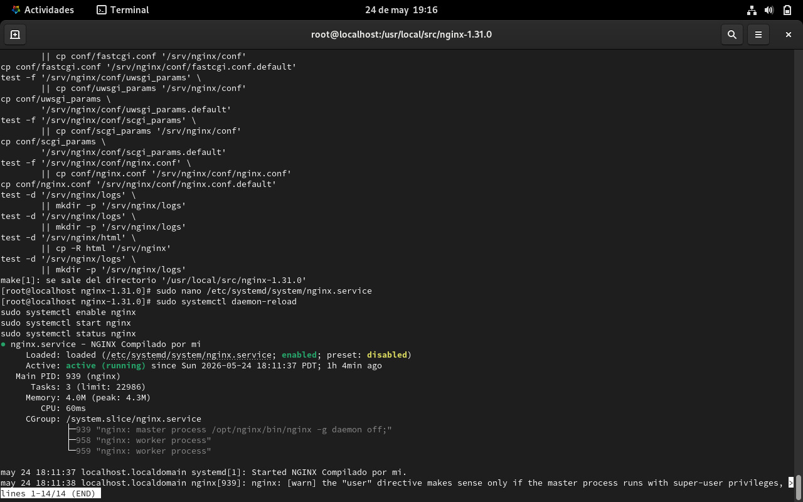
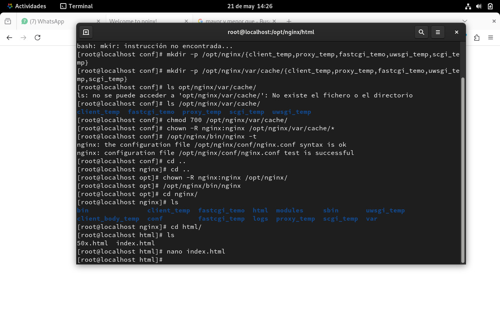

---

### 7. Registro del servicio systemd `nginx.service`

Para que el sistema pueda gestionar NGINX como servicio, creamos el archivo de unidad:

```bash
nano /etc/systemd/system/nginx.service
```

```ini
[Unit]
Description=NGINX HTTP Server 1.31.0 (compiled from source)
After=network.target

[Service]
Type=forking
PIDFile=/srv/nginx/logs/nginx.pid
ExecStartPre=/srv/nginx/sbin/nginx -t
ExecStart=/srv/nginx/sbin/nginx
ExecReload=/bin/kill -s HUP $MAINPID
ExecStop=/bin/kill -s QUIT $MAINPID
PrivateTmp=true

[Install]
WantedBy=multi-user.target
```

`WantedBy=multi-user.target` es lo que hace que NGINX arranque automáticamente con el sistema operativo.

```bash
systemctl daemon-reload
systemctl enable --now nginx
```

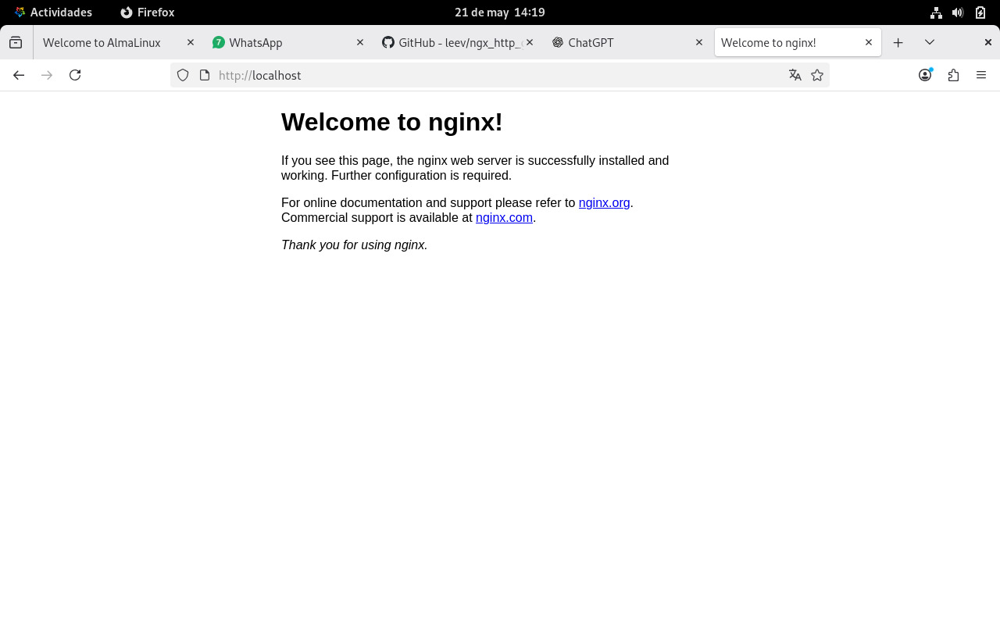
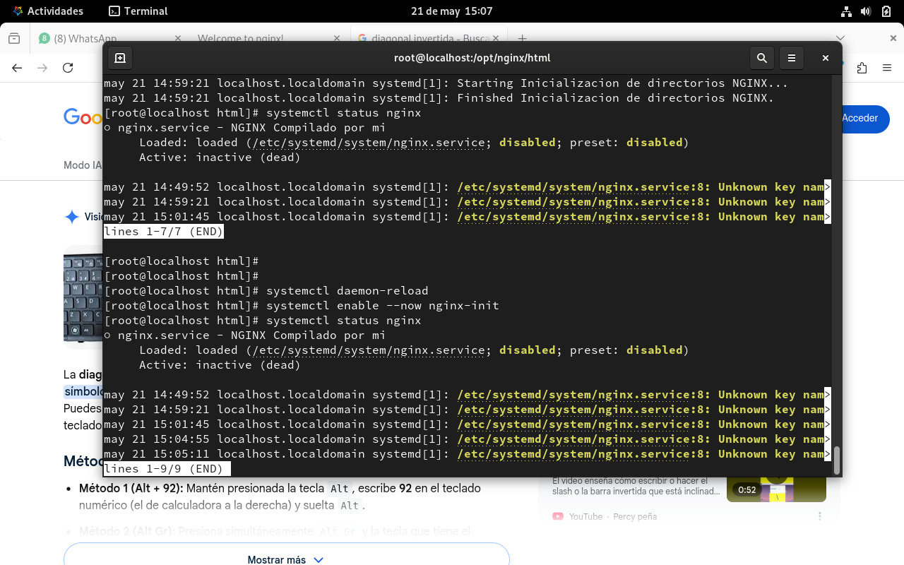

---

### 8. Verificación del servicio NGINX y prueba con `curl`

Confirmamos que el servicio quedó activo y que responde peticiones HTTP:

```bash
systemctl status nginx
curl http://localhost/
```

El `systemctl status` debe mostrar `active (running)` con el PID del proceso maestro y al menos 1 worker. El `curl` debe devolver el HTML del `index.html` de bienvenida instalado en `/srv/nginx/html/`.

```bash
# Detener y reiniciar para confirmar que todo funciona:
systemctl stop nginx
curl http://localhost/     # debe fallar: "Conexión rehusada"
systemctl start nginx
curl http://localhost/     # debe devolver el HTML
```

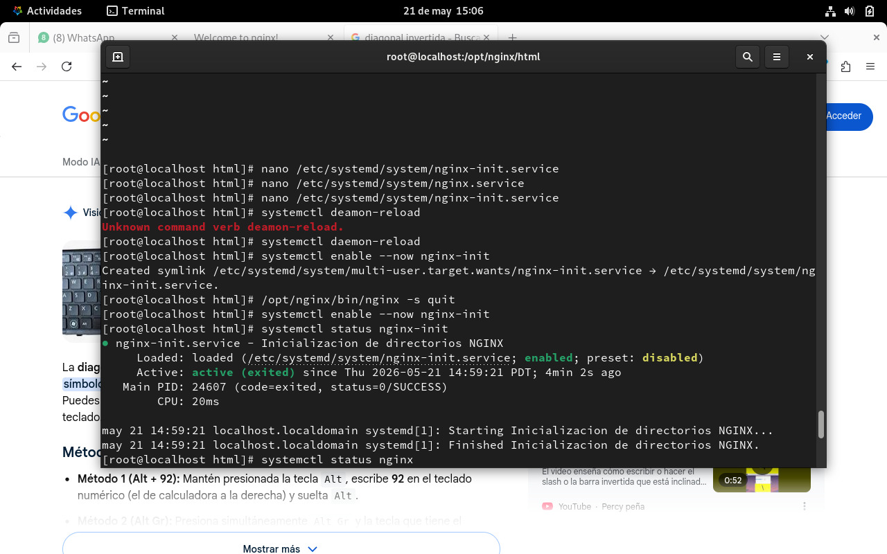
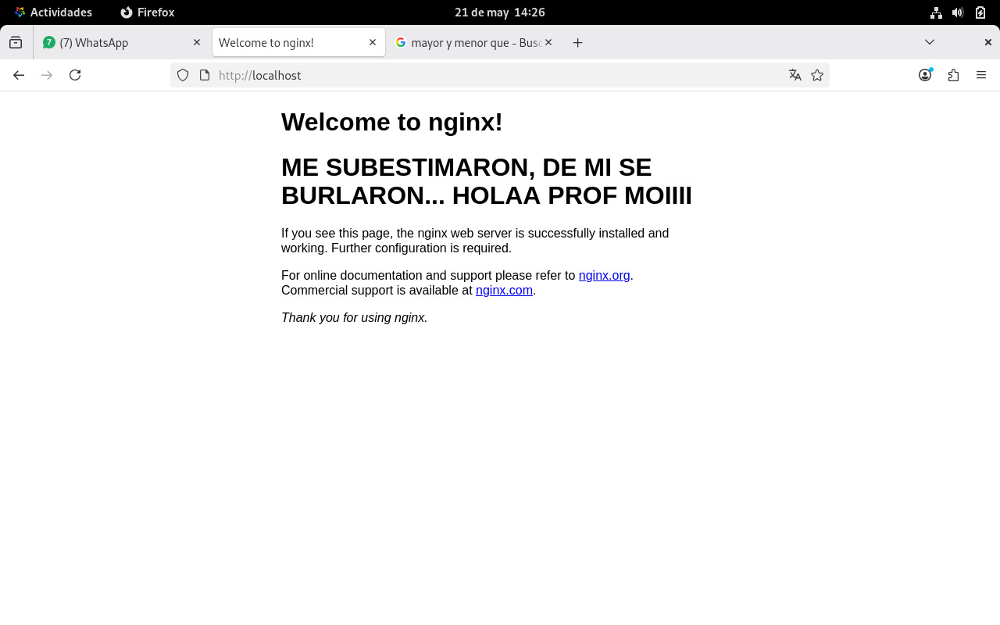

---

### 9. Instalación de dependencias para compilar PHP 8.4

PHP necesita muchas más bibliotecas que NGINX porque soporta una cantidad mayor de módulos opcionales. Instalamos todo de una sola vez:

```bash
dnf install -y gcc gcc-c++ make autoconf bison re2c libtool \
  glibc-devel libxml2-devel curl-devel oniguruma-devel libzip-devel \
  openssl-devel bzip2-devel libpng-devel libjpeg-turbo-devel \
  libwebp-devel freetype-devel libxslt-devel aspell-devel \
  libedit-devel readline-devel gettext-devel zlib-devel \
  libsodium-devel mariadb-connector-c-devel postgresql-devel \
  sqlite-devel icu libicu libicu-devel gmp-devel \
  libargon2-devel libuuid-devel systemd-devel firebird-devel
```

Las más importantes para este proyecto: `libpng-devel`, `libjpeg-turbo-devel`, `libwebp-devel` y `freetype-devel` para el módulo GD de imágenes; `libicu-devel` para internacionalización (`intl`); `openssl-devel` para HTTPS; `mariadb-connector-c-devel` para `mysqli`.

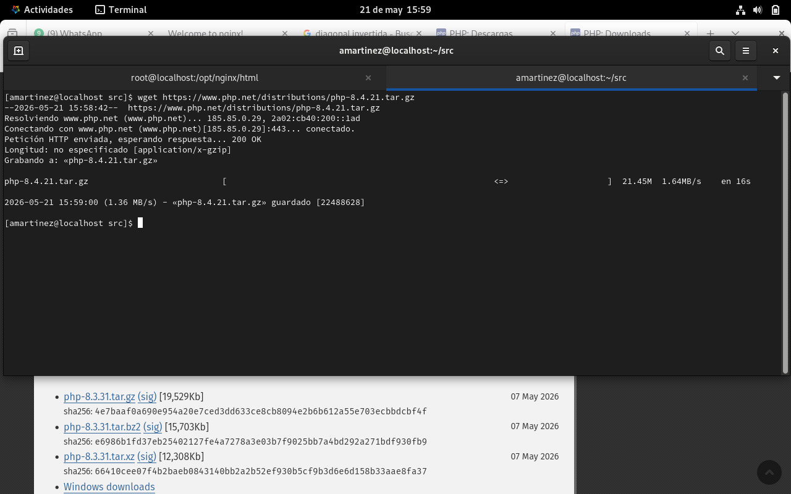
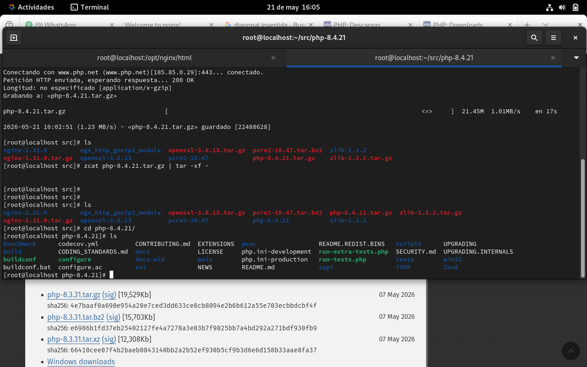
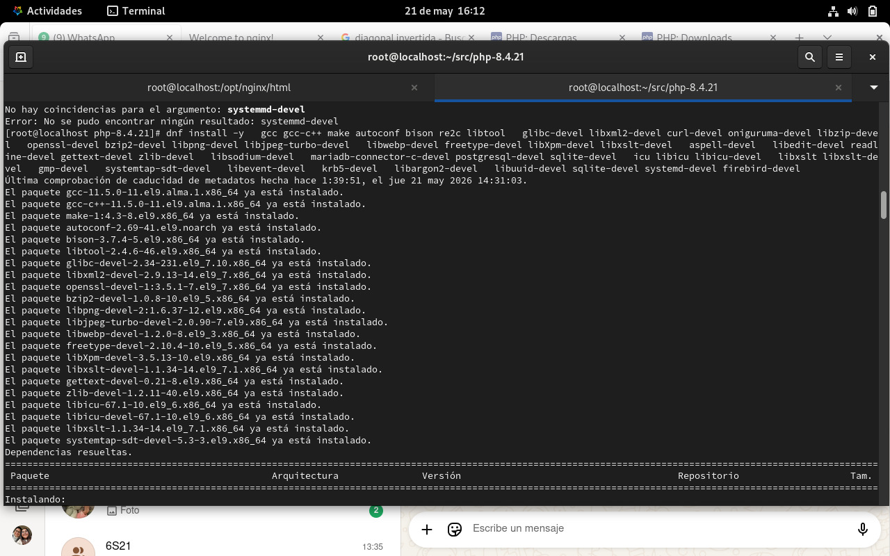

---

### 10. Descarga y extracción de PHP 8.4.21

```bash
wget https://www.php.net/distributions/php-8.4.21.tar.gz
zcat php-8.4.21.tar.gz | tar -xf -
cd php-8.4.21/
```

El tarball pesa aproximadamente 21 MB. Al extraerlo se genera el directorio `php-8.4.21/` con todo el código fuente incluyendo `configure`, `ext/` (extensiones), `sapi/` (interfaces como FPM y CLI) y los archivos `php.ini-production` y `php.ini-development`.


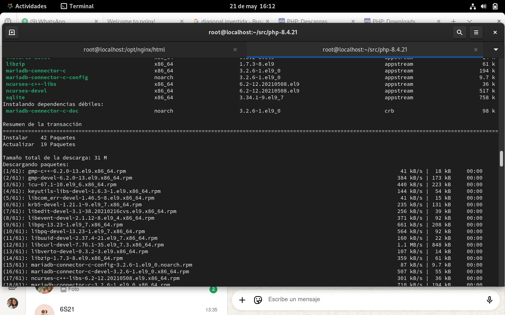

---

### 11. Definición de flags de compilación

Antes de ejecutar el configure, definimos variables de entorno para que el compilador optimice el código para la arquitectura del procesador del servidor:

```bash
export CFLAGS='-march=skylake -mtune=skylake -O3 -pipe'
export CXXFLAGS=$CFLAGS
```

- `-march=skylake` — genera instrucciones optimizadas para procesadores Intel Skylake y compatibles.
- `-O3` — nivel máximo de optimización del compilador.
- `-pipe` — usa pipes en lugar de archivos temporales durante la compilación, reduciendo I/O en disco.

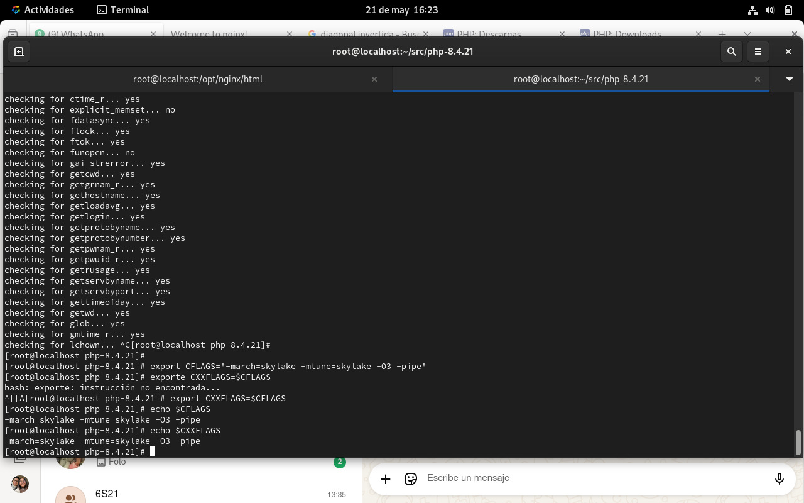

---

### 12. Ejecución de `./configure` de PHP — verificación de capacidades

El script `./configure` revisa el sistema y genera el `Makefile` adaptado al entorno. Con todos los módulos requeridos:

```bash
./configure \
  --prefix=/srv/php \
  --enable-fpm \
  --with-fpm-user=php \
  --with-fpm-group=nginx \
  --with-openssl \
  --with-curl \
  --enable-mbstring \
  --enable-opcache \
  --with-freetype \
  --enable-gd \
  --with-iconv \
  --with-zip \
  --enable-intl \
  --with-pear \
  --enable-ftp \
  --enable-cli \
  --with-xsl \
  --with-pdo-sqlite \
  --with-gmp \
  --with-mysqli \
  --enable-sodium
```

Durante la ejecución, el configure verifica funciones del sistema como `flock`, `gethostname`, `getloadavg`, entre otras, para saber qué puede y qué no puede compilar.

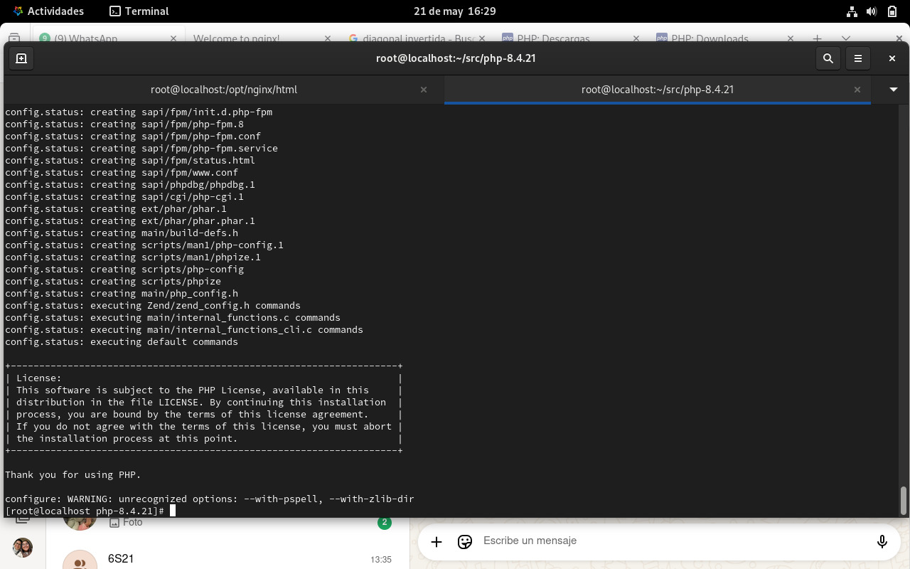
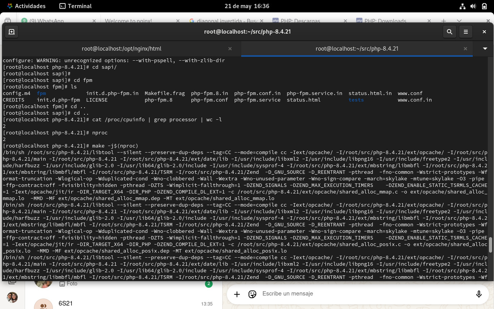
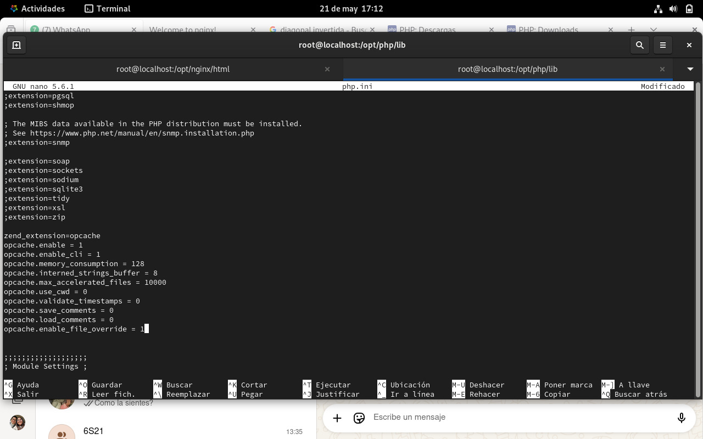

---

### 13. Resumen final del `./configure` de PHP

Al terminar, el configure imprime un resumen con todos los archivos generados: `Makefile`, `main/php_config.h`, configuración de FPM, phpdbg y CGI. También muestra que la licencia PHP fue aceptada.

Los módulos más importantes confirmados en el resumen:

| Módulo | Flag usado | Para qué sirve |
|---|---|---|
| FPM | `--enable-fpm` | Comunicación con NGINX vía FastCGI |
| GD + Freetype | `--enable-gd --with-freetype` | Procesamiento de imágenes |
| intl | `--enable-intl` | Internacionalización y fechas |
| OPcache | `--enable-opcache` | Caché de bytecode + JIT |
| mysqli | `--with-mysqli` | Conexión a MySQL/MariaDB |
| sodium | `--enable-sodium` | Funciones criptográficas modernas |

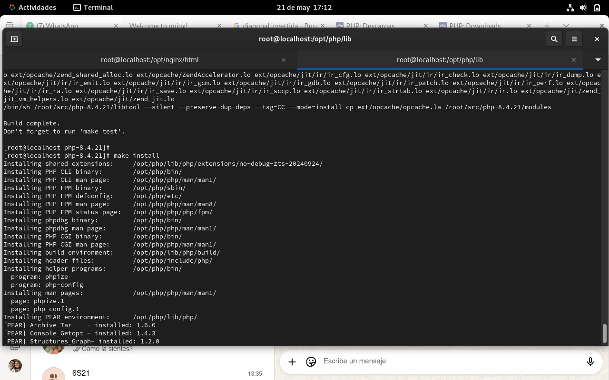
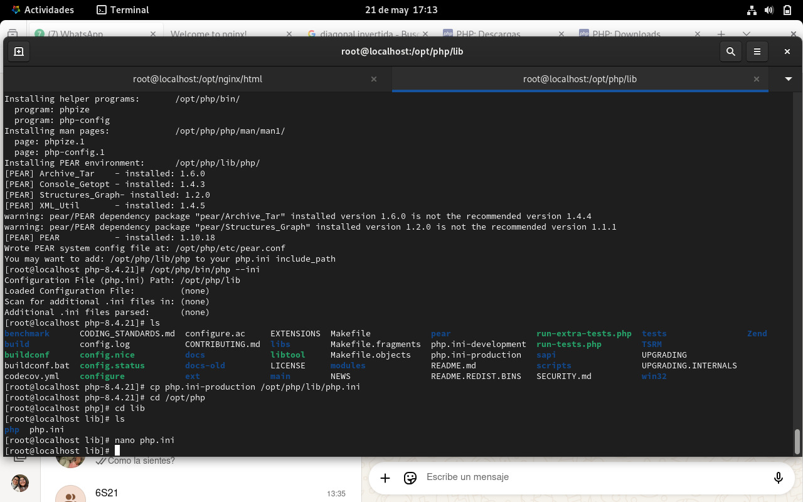

---

### 14. Compilación de PHP con `make -j$(nproc)`

```bash
make -j$(nproc)
```

La compilación de PHP tarda considerablemente más que la de NGINX porque tiene muchos más archivos fuente. En esta máquina con 2 núcleos procesó los archivos del core, las extensiones, OPcache y el compilador JIT. Se puede ver en la terminal cómo va compilando archivo por archivo con sus flags de optimización.

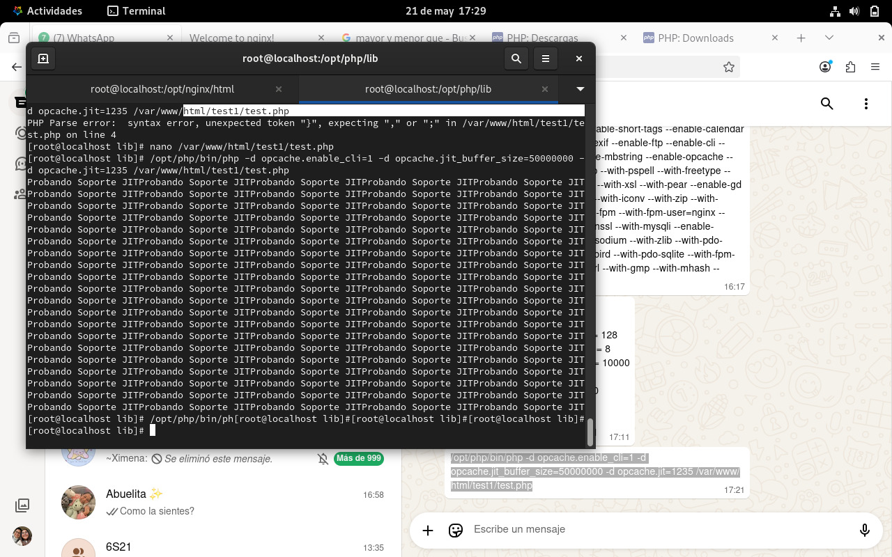
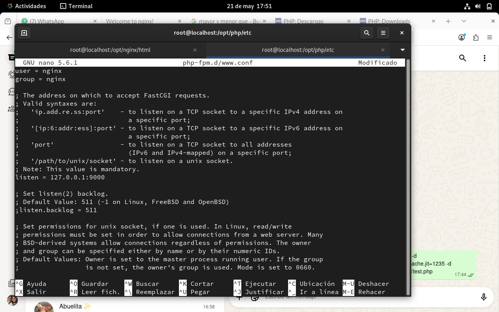

---

### 15. Instalación de PHP con `make install`

```bash
make install
```

Al terminar, los archivos quedan distribuidos en el prefix `/srv/php/`:

```
/srv/php/bin/php            ← CLI de PHP
/srv/php/sbin/php-fpm       ← proceso PHP-FPM
/srv/php/lib/php/extensions/no-debug-zts-20240924/   ← extensiones .so
/srv/php/bin/pecl            ← gestor de extensiones PECL
/srv/php/bin/pear            ← gestor PEAR
```


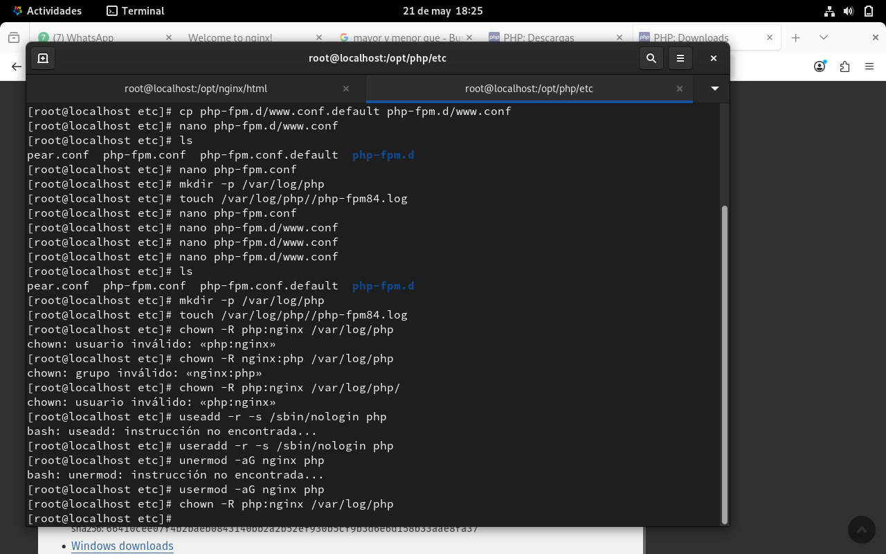

---

### 16. Configuración de `php.ini`

Copiamos la plantilla de producción como archivo de configuración base:

```bash
cp ~/src/php-8.4.21/php.ini-production /srv/php/lib/php.ini
cd /srv/php/lib
nano php.ini
```

Agregamos al final del archivo la configuración de OPcache y JIT:

```ini
[opcache]
zend_extension=opcache
opcache.enable=1
opcache.memory_consumption=128
opcache.interned_strings_buffer=8
opcache.max_accelerated_files=4000
opcache.revalidate_freq=60
opcache.enable_cli=1
opcache.jit_buffer_size=50M
opcache.jit=1235
```

`opcache.jit=1235` activa el compilador JIT en modo de trazado, que es el más agresivo en optimización para código repetitivo.


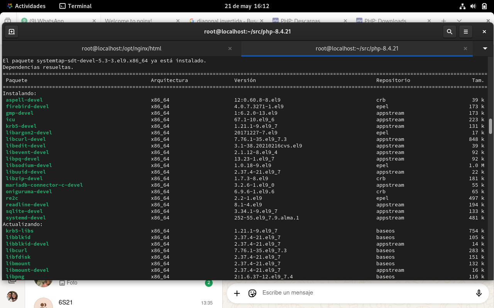

---

### 17. Creación del usuario de sistema `php` y permisos de logs

El servicio PHP-FPM correrá bajo un usuario dedicado `php` que pertenece al grupo `nginx`. Así NGINX puede leer el socket sin necesitar permisos de root:

```bash
useradd -r -s /sbin/nologin php
usermod -aG nginx php
```

Creamos el directorio de logs y asignamos los permisos correctos:

```bash
mkdir -p /var/log/php
touch /var/log/php/php-fpm84.log
touch /var/log/php/www-slow.log
touch /var/log/php/www-error.log
chown -R php:nginx /var/log/php
ls -la /var/log/php/
```

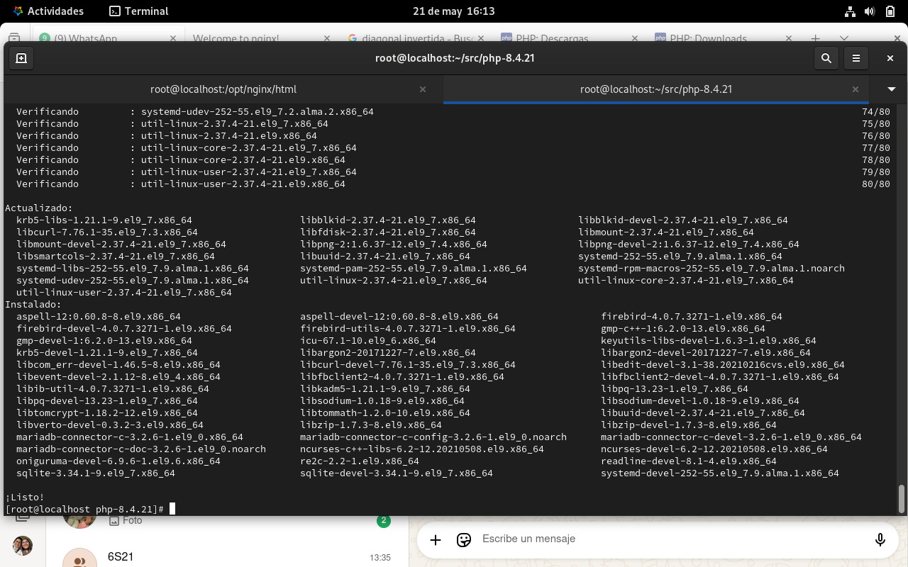
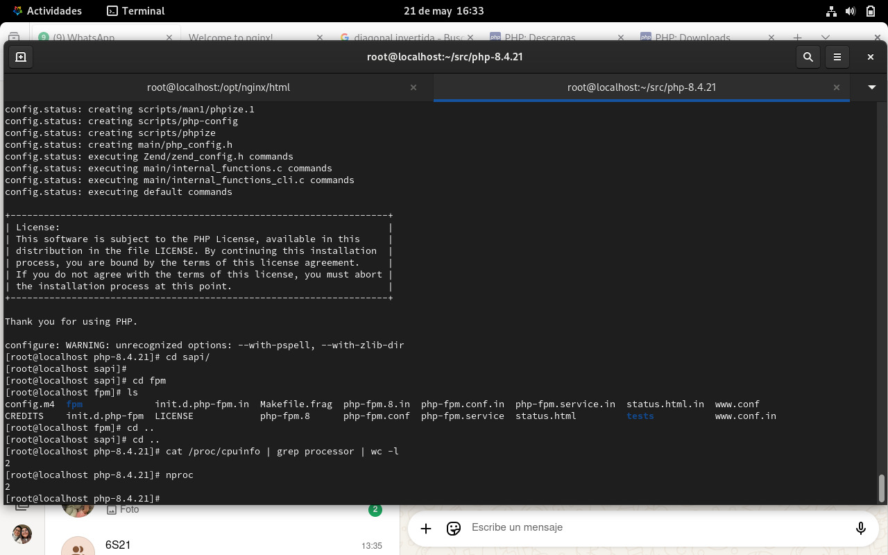

---

### 18. Configuración de PHP-FPM (`php-fpm.conf` y `www.conf`)

Copiamos los archivos de configuración de ejemplo:

```bash
cd /srv/php/etc
cp php-fpm.conf.default php-fpm.conf
cp php-fpm.d/www.conf.default php-fpm.d/www.conf
nano php-fpm.d/www.conf
```

En `www.conf` configuramos el usuario, grupo y los archivos de log del pool:

```ini
user = php
group = nginx
slowlog = /var/log/php/www-slow.log
request_slowlog_timeout = 10
```


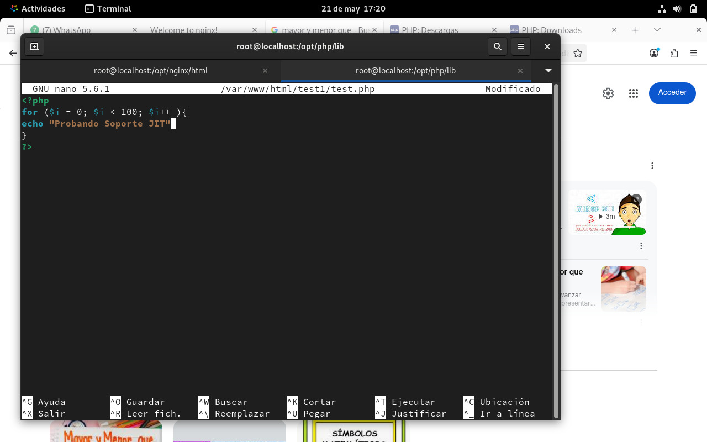

---

### 19. Cambio de socket TCP a socket UNIX

Por defecto, PHP-FPM escucha en `127.0.0.1:9000` (TCP). Lo cambiamos a socket UNIX porque es más eficiente para comunicación local entre NGINX y PHP en el mismo servidor:

```ini
; Antes (TCP):
; listen = 127.0.0.1:9000

; Después (socket UNIX):
listen = /tmp/php84.sock
listen.owner = php
listen.group = nginx
listen.mode = 0660
```

La diferencia es que el socket UNIX es literalmente un archivo en el sistema de archivos. No pasa por la pila de red, por lo que tiene menos overhead y mayor velocidad.

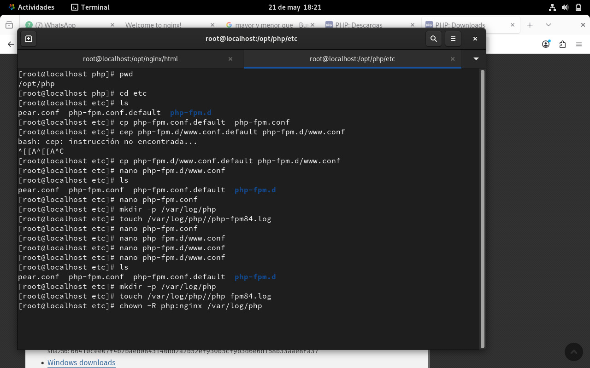
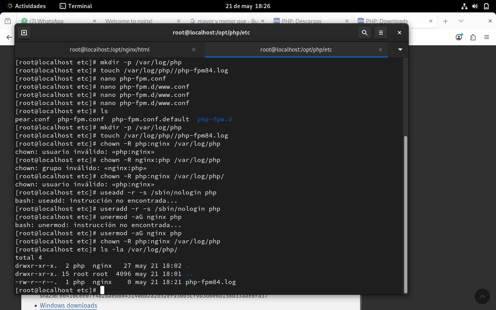

---

### 20. Creación de archivos de log y verificación de permisos

Además del log principal de PHP-FPM, creamos logs dedicados para errores y solicitudes lentas:

```bash
touch /var/log/php/www-slow.log
touch /var/log/php/www-error.log
touch /var/log/php/php-errors.log
chown php:nginx /var/log/php/*.log
ls -la /var/log/php/
```

El listado final debe mostrar todos los archivos con propietario `php:nginx` y permisos `rw-r--r--`. Tener los logs separados facilita el diagnóstico cuando algo falla.

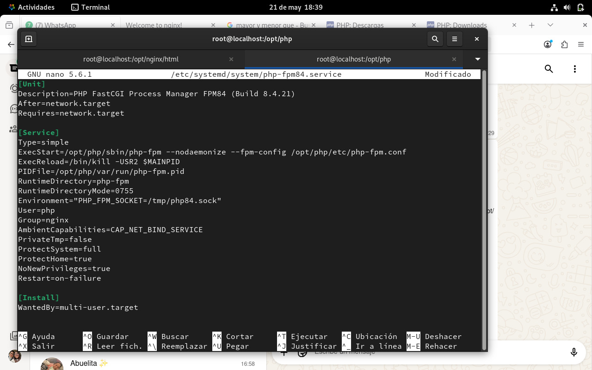
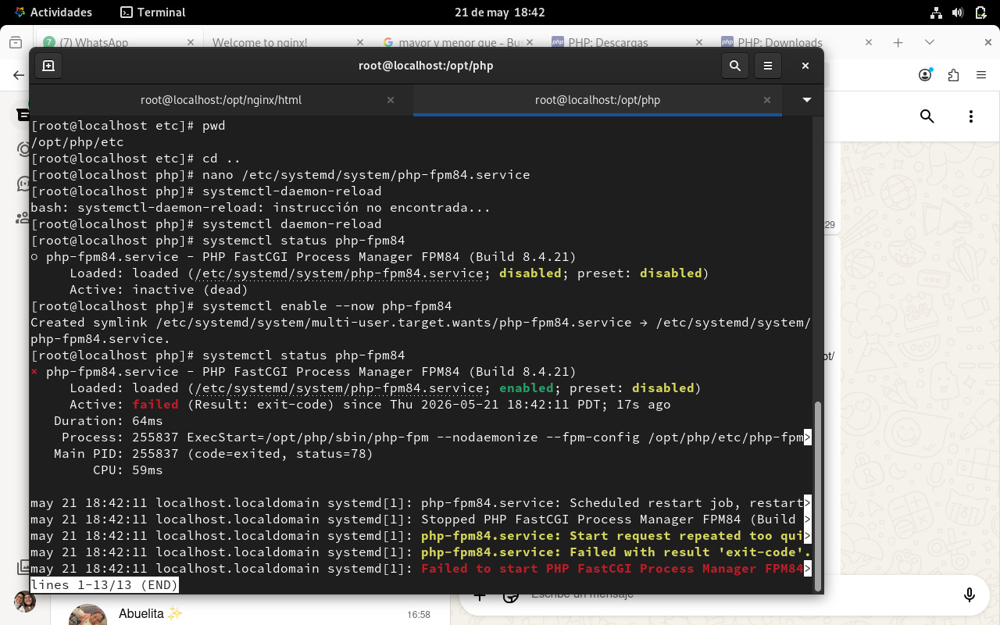

---

### 21. Configuración del slow log en `www.conf`

El slow log registra automáticamente cualquier script PHP que tarde más de N segundos en responder. Es útil para detectar cuellos de botella en producción:

```ini
slowlog = /var/log/php/www_slow.log
request_slowlog_timeout = 10
```

Con `request_slowlog_timeout = 10`, si un script tarda más de 10 segundos, PHP-FPM guarda un stack trace completo en el slow log, mostrando exactamente qué función estaba ejecutando y por cuánto tiempo.

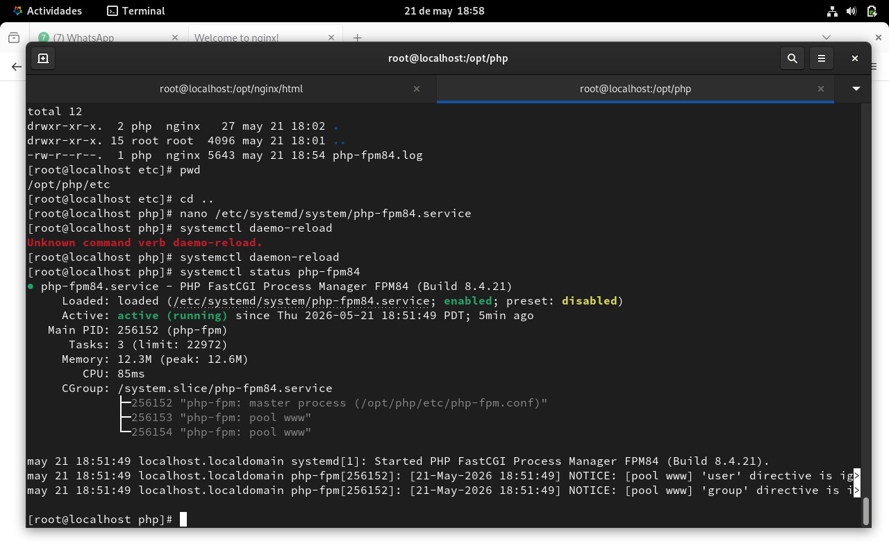
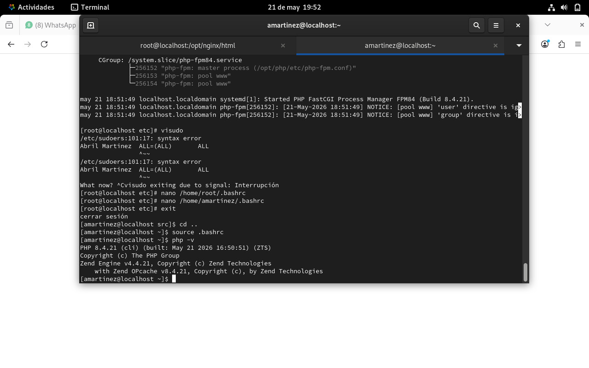

---

### 22. Registro del servicio `php-fpm8.4.service` en systemd

```bash
nano /etc/systemd/system/php-fpm8.4.service
```

```ini
[Unit]
Description=PHP FastCGI Process Manager 8.4.21
After=network.target

[Service]
Type=simple
ExecStart=/srv/php/sbin/php-fpm --nodaemonize --fpm-config /srv/php/etc/php-fpm.conf
ExecReload=/bin/kill -USR2 $MAINPID
PIDFile=/srv/php/var/run/php-fpm.pid
Environment="PHP_FPM_SOCKET=/tmp/php84.sock"
User=php
Group=nginx
PrivateTmp=false
ProtectSystem=full
ProtectHome=true
NoNewPrivileges=true
Restart=on-failure

[Install]
WantedBy=multi-user.target
```

`--nodaemonize` es necesario porque systemd prefiere gestionar el proceso en primer plano. `Restart=on-failure` hace que el servicio se reinicie automáticamente si falla inesperadamente.

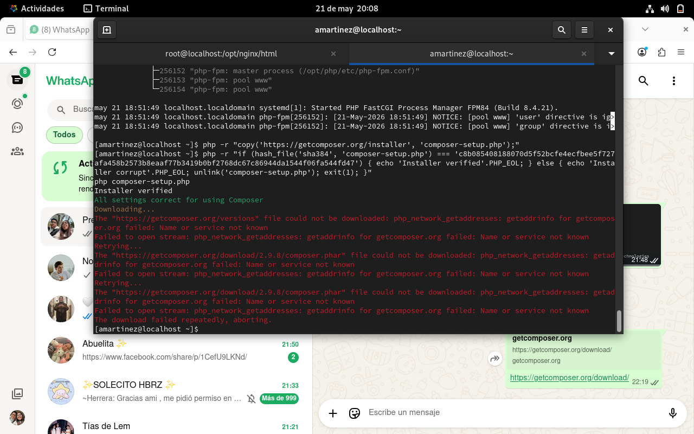
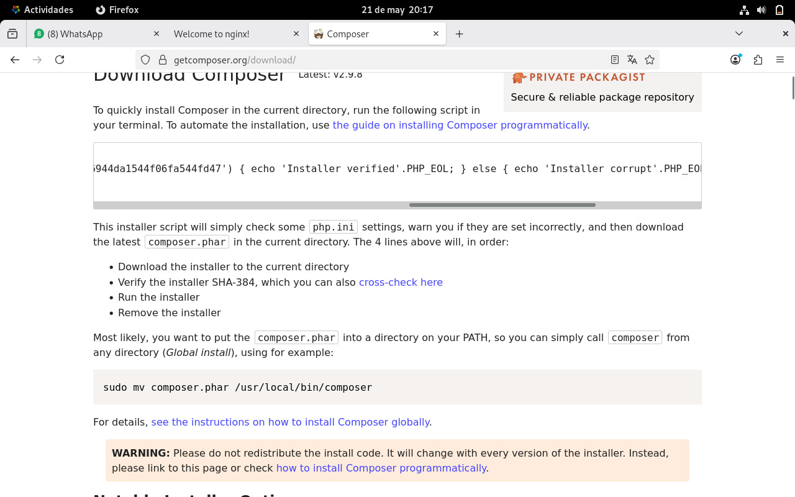

---

### 23. Primer arranque fallido del servicio PHP-FPM y diagnóstico

Al intentar iniciar el servicio por primera vez, falló con estado `failed (exit-code)`:

```bash
systemctl daemon-reload
systemctl enable --now php-fpm8.4
systemctl status php-fpm8.4
```

Para ver el error específico:

```bash
journalctl -xe -u php-fpm8.4
```

El log mostró: `ERROR: unable to bind listening socket for address '/temp/php84.sock': No such file or directory`. El problema era un typo en la ruta del socket: `/temp/` en lugar de `/tmp/`.


---

### 24. Corrección de la ruta del socket y reinicio exitoso

Editamos `www.conf` para corregir el typo:

```bash
nano /srv/php/etc/php-fpm.d/www.conf
```

```ini
; Incorrecto:
; listen = /temp/php84.sock

; Correcto:
listen = /tmp/php84.sock
```

Reiniciamos el servicio:

```bash
systemctl restart php-fpm8.4
systemctl status php-fpm8.4
```

Esta vez el log mostró `ready to handle connections` y el servicio quedó en estado `active (running)`.

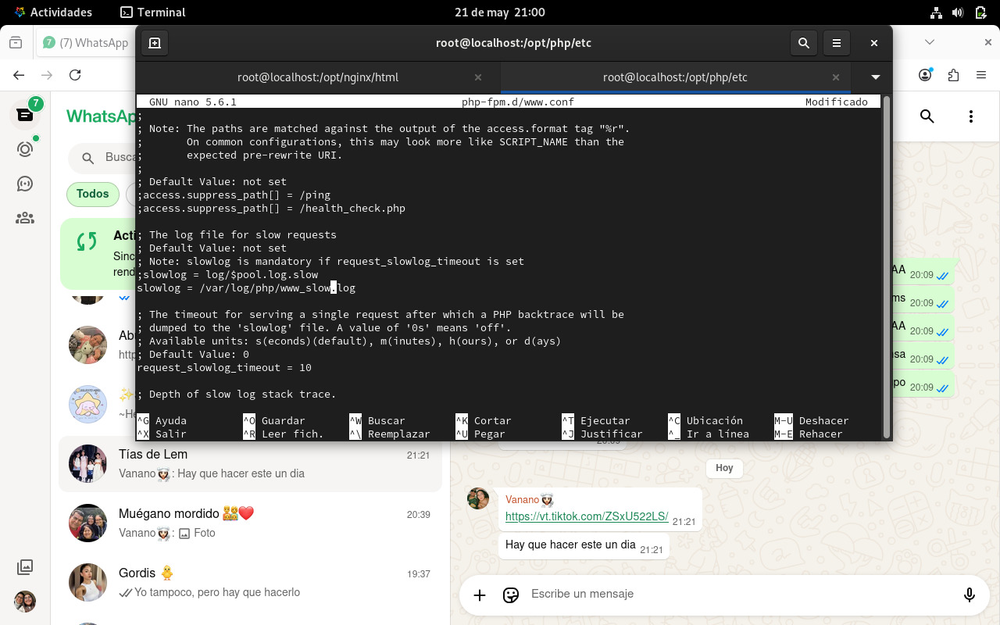
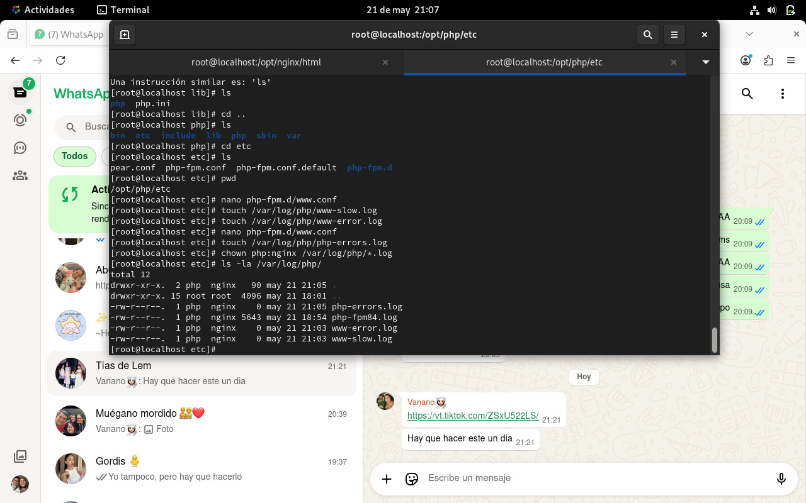

---

### 25. Estado final del servicio PHP-FPM activo con workers

Con el servicio corriendo correctamente, verificamos que el proceso maestro y los workers del pool `www` estén activos:

```bash
systemctl status php-fpm8.4
```

La salida muestra: estado `active (running)`, PID del proceso maestro, 3 tareas activas (1 master + 2 workers del pool `www`) y el consumo de memoria. Los dos workers son los que realmente procesan las peticiones PHP que llegan desde NGINX.

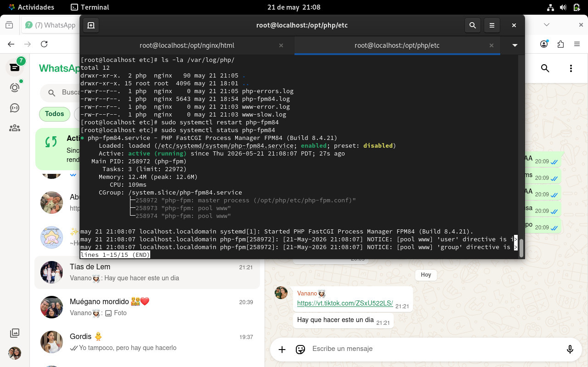
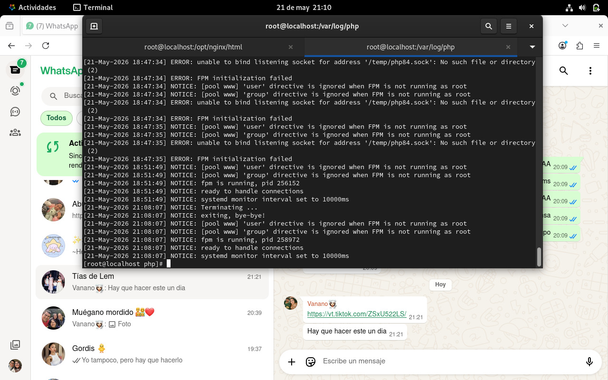

---

### 26. Verificación de PHP desde línea de comandos con `php -v`

Agregamos el binario de PHP al PATH del usuario para poder invocarlo directamente sin escribir la ruta completa:

```bash
nano /home/amartinez/.bashrc
# Agregar al final:
export PATH="/srv/php/bin:$PATH"

source ~/.bashrc
php -v
```

La salida confirma:

```
PHP 8.4.21 (cli) (built: May 21 2026 16:50:51) (ZTS)
Zend Engine v4.4.21, Copyright (c) Zend Technologies
	with Zend OPcache v8.4.21, Copyright (c), by Zend Technologies
```

`ZTS` significa *Zend Thread Safety*, que es requerido cuando se usa PHP-FPM con múltiples workers concurrentes.

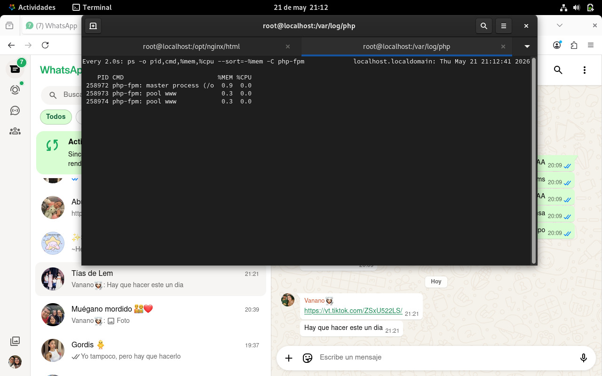
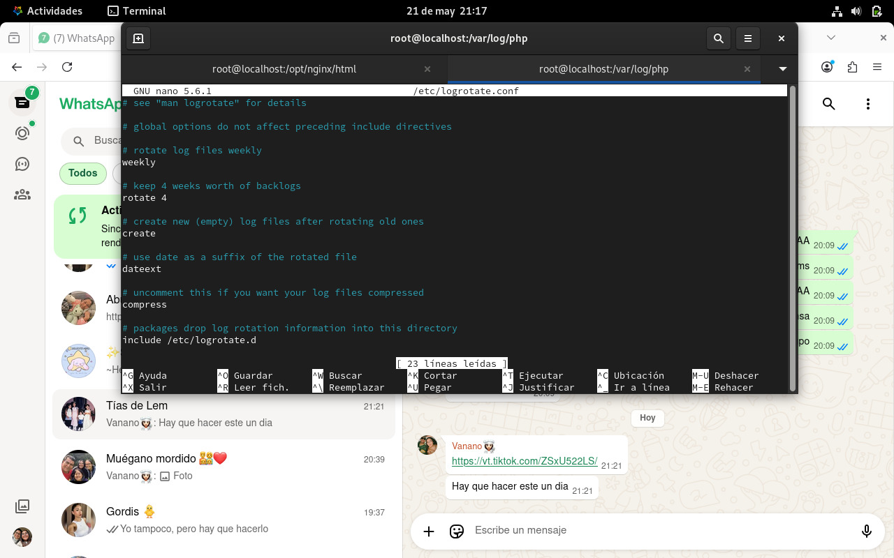

---

### 27. Monitoreo de procesos PHP-FPM con `watch` y `ps`

Para ver en tiempo real los procesos PHP-FPM y su consumo de recursos:

```bash
watch -n 2.0 "ps -o pid,cmd,%mem,%cpu --sort=-%mem -C php-fpm"
```

Esto refresca cada 2 segundos la lista de procesos PHP-FPM. En reposo se ven 3 procesos: el master y los 2 workers, consumiendo aproximadamente 0.9% y 0.3% de memoria respectivamente, con 0.0% de CPU mientras esperan peticiones.

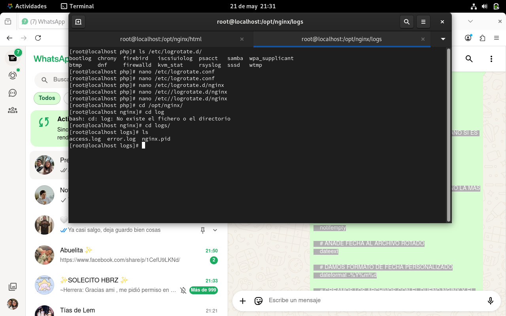
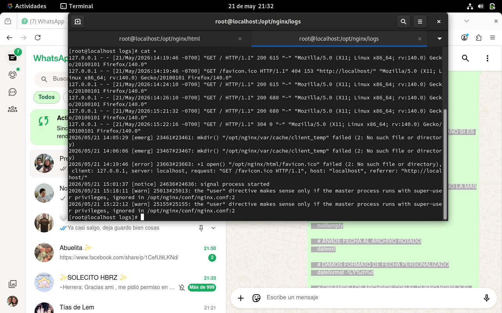

---

### 28. Prueba de soporte JIT desde CLI

Creamos un script de prueba para verificar que el compilador JIT está operativo:

```bash
nano /srv/nginx/html/test_jit.php
```

```php
<?php
for ($i = 0; $i < 100; $i++) {
	echo "Probando Soporte JIT\n";
}
?>
```

Ejecutamos desde CLI activando JIT explícitamente:

```bash
/srv/php/bin/php -d opcache.enable_cli=1 \
  -d opcache.jit_buffer_size=50000000 \
  -d opcache.jit=1235 \
  /srv/nginx/html/test_jit.php
```

El script debe imprimir `Probando Soporte JIT` cien veces. Si lo hace sin error, el motor JIT de PHP 8.4 está funcionando correctamente.

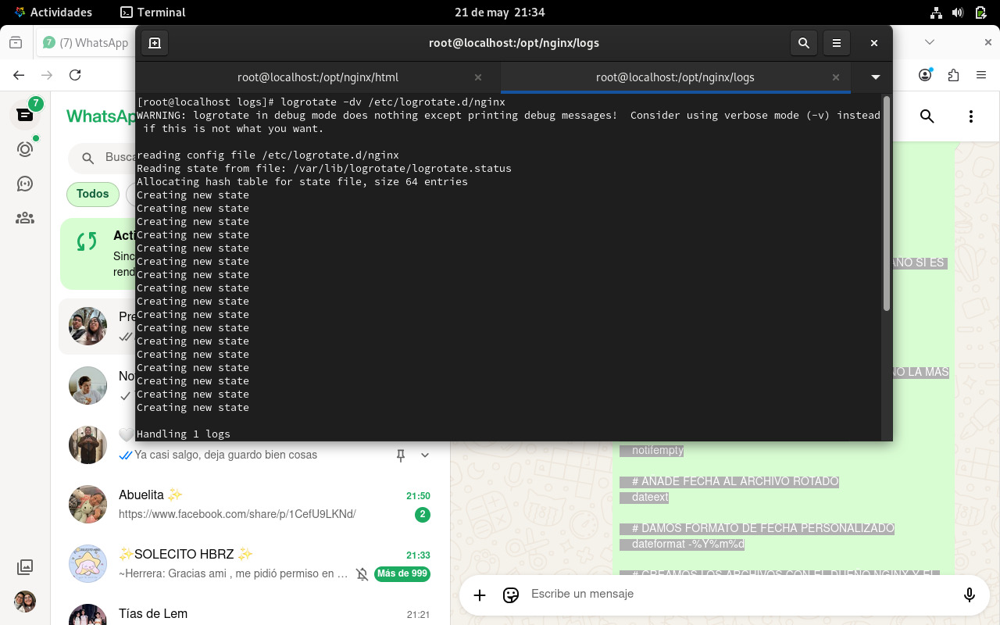
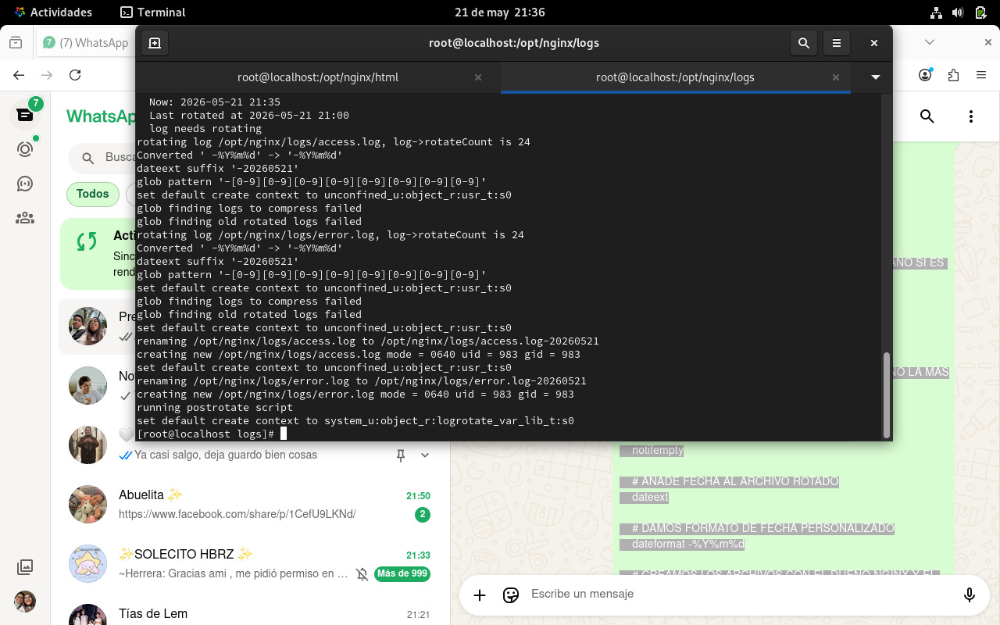

---

### 29. Configuración de logrotate para NGINX

Para evitar que los logs de NGINX crezcan indefinidamente, configuramos rotación automática:

```bash
ls /etc/logrotate.d/
nano /etc/logrotate.conf
nano /etc/logrotate.d/nginx
```

Contenido de `/etc/logrotate.d/nginx`:

```
/srv/nginx/logs/*.log {
	weekly
	rotate 4
	compress
	dateext
	missingok
	notifempty
	sharedscripts
	postrotate
		/srv/nginx/sbin/nginx -s reopen
	endscript
}
```

`compress` guarda los logs rotados en formato `.gz`. `rotate 4` mantiene solo las últimas 4 semanas. `postrotate` le dice a NGINX que abra nuevos archivos de log después de rotar.

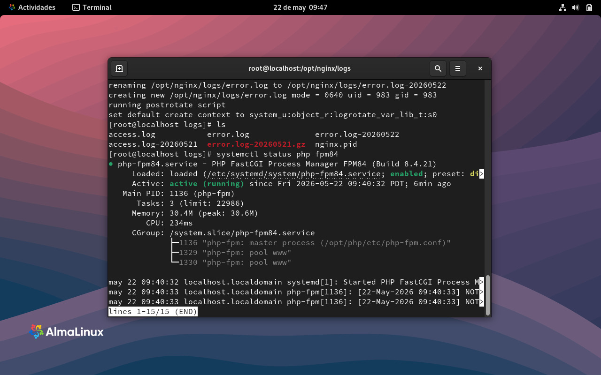


---

### 30. Prueba de logrotate en modo debug

Antes de depender de logrotate en producción, lo probamos en modo debug para verificar que no hay errores en la configuración:

```bash
logrotate -dv /etc/logrotate.d/nginx
```

La flag `-d` activa el modo debug (no hace cambios reales, solo simula). La flag `-v` muestra todo el proceso paso a paso. Debemos ver cómo detecta `access.log` y `error.log`, genera los nombres con fecha (`access.log-20260521`) y confirma el script postrotate.


---

### 31. Verificación de logs rotados y estado de servicios al día siguiente

Al retomar el proyecto al día siguiente, verificamos que la rotación del día anterior se ejecutó:

```bash
cd /srv/nginx/logs/
ls
```

El directorio debe mostrar los archivos rotados junto a los nuevos:

```
access.log
access.log-20260521
error.log
error.log-20260521
nginx.pid
```

También confirmamos que ambos servicios siguen activos tras la sesión anterior:

```bash
systemctl status php-fpm8.4
```


---

### 32. Creación de estructura de virtual hosts en NGINX

Para organizar la configuración de NGINX y soportar múltiples sitios, creamos los directorios necesarios:

```bash
cd /srv/nginx
mkdir -p /srv/nginx/conf/conf.d
mkdir -p /srv/nginx/conf/sites-enabled
mkdir -p /srv/nginx/conf/snippets
```

Hacemos una copia de seguridad del `nginx.conf` original antes de modificarlo:

```bash
cp /srv/nginx/conf/nginx.conf /srv/nginx/conf/nginx.conf.original
```

Editamos `nginx.conf` para incluir los archivos de sitios al final del bloque `http {}`:

```nginx
include /srv/nginx/conf/sites-enabled/*.conf;
```


---

### 33. Configuración del `nginx.conf` principal

Verificamos la sintaxis del `nginx.conf` después de agregar el `include`:

```bash
/srv/nginx/sbin/nginx -t
```

La salida debe ser:

```
nginx: the configuration file /srv/nginx/conf/nginx.conf syntax is ok
nginx: configuration file /srv/nginx/conf/nginx.conf test is successful
```

Si hay error, indica exactamente en qué línea está el problema, lo cual facilita mucho el diagnóstico.


---

### 34. Creación del virtual host `localhost.conf` y corrección de typo

Creamos el primer virtual host para pruebas locales:

```bash
cd /srv/nginx/conf/sites-enabled/
nano localhost.conf
/srv/nginx/sbin/nginx -t
```

En el primer intento, el `nginx -t` reportó:

```
unknown directive "error_pagee" in /srv/nginx/conf/sites-enabled/localhost.conf
```

Abrimos el archivo nuevamente, corregimos `error_pagee` a `error_page` y volvimos a validar. El segundo intento confirmó `syntax is ok`.

Esto es un ejemplo de por qué siempre hay que correr `nginx -t` antes de recargar: un typo puede dejar el servidor sin poder reiniciarse.


---

### 35. Creación del virtual host `amartinez.localdomain.conf` con FastCGI

Creamos el archivo de configuración del sitio principal con la integración FastCGI hacia PHP-FPM:

```bash
nano /srv/nginx/conf/sites-enabled/amartinez.localdomain.conf
```

```nginx
server {
	listen 80;
	listen [::]:80;
	server_name amartinez.localdomain;
	root /srv/nginx/html;

	access_log logs/amartinez.access.log combined;
	error_log  logs/amartinez.error.log warn;

	index index.php index.html index.htm;
	client_max_body_size 100M;
	charset utf-8;

	location /favicon.ico { access_log off; log_not_found off; }
	location /robots.txt  { access_log off; log_not_found off; }

	error_page 404 /index.php;

	location ~ \.php$ {
		root           /srv/nginx/html;
		fastcgi_pass   unix:/tmp/php84.sock;
		fastcgi_index  index.php;
		fastcgi_param  SCRIPT_FILENAME $document_root$fastcgi_script_name;
		include        fastcgi_params;
	}

	location ~ /\.(?!well-known).* {
		deny all;
	}
}
```

La directiva clave es `fastcgi_pass unix:/tmp/php84.sock` — es el puente entre NGINX y PHP-FPM.


---

### 36. Registro de `amartinez.localdomain` en `/etc/hosts`

Para que el sistema resuelva el dominio local sin necesitar un servidor DNS externo:

```bash
nano /etc/hosts
```

Agregamos al final:

```
127.0.0.1 amartinez.localdomain
```

Este archivo tiene prioridad sobre el DNS. Cualquier petición al dominio `amartinez.localdomain` se resuelve directamente a la IP de loopback `127.0.0.1`.


---

### 37. Verificación de resolución DNS local con `ping`

Confirmamos que el dominio resuelve correctamente:

```bash
ping -c 4 amartinez.localdomain
```

La salida debe mostrar `PING amartinez.localdomain (127.0.0.1)` con los 4 paquetes enviados, 0% de pérdida, y tiempos de respuesta muy bajos (menos de 1 ms) porque es comunicación local.

```
4 packets transmitted, 4 received, 0% packet loss
rtt min/avg/max = 0.073/0.129/0.173 ms
```


---

### 38. Validación de sintaxis NGINX y recarga del servicio

Antes de aplicar cualquier cambio de configuración, siempre validamos:

```bash
/srv/nginx/sbin/nginx -t
/srv/nginx/sbin/nginx -s reload
```

`-s reload` recarga la configuración sin interrumpir las conexiones activas. NGINX levanta nuevos workers con la nueva configuración y termina los viejos ordenadamente. Solo se ejecuta si `-t` no reportó errores.

```bash
systemctl status nginx
```


---

### 39. Corrección iterativa de errores en la configuración FastCGI

Durante la configuración del virtual host se presentaron varios errores tipográficos seguidos:

```bash
nano amartinez.localdomain.conf
/srv/nginx/sbin/nginx -t
# Error 1: unknown directive "/temp/php84.sock"
# (faltaba "unix:" antes de la ruta)

nano amartinez.localdomain.conf
/srv/nginx/sbin/nginx -t
# Error 2: unknown directive "denny"
# (typo de "deny")

nano amartinez.localdomain.conf
/srv/nginx/sbin/nginx -t
# nginx: syntax is ok — correcto
```

Cada error fue diferente pero el proceso fue el mismo: identificar la línea exacta del error con `nginx -t`, abrir el archivo con `nano`, corregir y volver a validar.


---

### 40. Prueba de archivo PHP con `curl -H "Host:"`

Creamos un archivo de prueba y lo solicitamos a través del virtual host:

```bash
echo "<?php echo 'Hola, este es mi archivo de prueba PHP'; ?>" > /srv/nginx/html/test.php
curl -H "Host: amartinez.localdomain" http://127.0.0.1/test.php
```

La flag `-H "Host: amartinez.localdomain"` fuerza a NGINX a usar el virtual host correcto sin necesitar que el DNS esté configurado en el cliente. Si PHP-FPM está integrado correctamente, la respuesta debe ser el texto plano `Hola, este es mi archivo de prueba PHP` sin el código PHP visible.


---

### 41. Verificación del virtual host desde Firefox

Accedemos directamente desde el navegador para confirmar que NGINX responde con el `server_name` configurado:

```
http://amartinez.localdomain
```

Antes de esta prueba, era necesario que `/etc/hosts` tuviera la entrada correcta en la máquina donde corre el navegador. Sin esa entrada, el navegador no puede resolver el nombre y muestra error de DNS.

La página debe mostrar el `index.html` personalizado del servidor. Si en cambio muestra la página de bienvenida por defecto de NGINX, significa que el virtual host no está siendo seleccionado correctamente.


---

### 42. Prueba de `phpinfo()` desde CLI y navegador

Creamos el archivo `info.php`:

```bash
echo "<?php phpinfo(); ?>" > /srv/nginx/html/info.php
```

Desde CLI:

```bash
curl -H "Host: amartinez.localdomain" http://127.0.0.1/info.php | grep -E "PHP Version|Server API"
```

Desde el navegador:

```
http://amartinez.localdomain/info.php
```

La página debe mostrar **PHP 8.4.21**, `Server API: FPM/FastCGI`, `Configuration File: /srv/php/lib/php.ini`, y los módulos compilados. Si muestra el código fuente PHP en lugar de ejecutarlo, significa que la directiva `fastcgi_pass` no está funcionando.


---

### 43. Instalación de la extensión MongoDB vía PECL

PECL es el gestor de extensiones de PHP, similar a `dnf` pero para extensiones PHP. Lo usamos para instalar MongoDB:

```bash
which pecl
# No está en el PATH estándar, usamos la ruta completa:
/srv/php/bin/pecl install mongodb
```

El proceso descarga `mongodb-2.3.3.tgz` (~2.2 MB), ejecuta `phpize` para preparar el entorno de compilación detectando PHP 8.4 con Zend Module API 20240924, y pregunta `Enable developer flags? (yes/no) [no]` — respondemos `no` para una instalación normal.


---

### 44. Compilación de la extensión MongoDB

PECL compila automáticamente la extensión con todas sus dependencias internas (`libmongoc`, `libbson`, `libmongocrypt`) aplicando los flags del sistema. Son 902 archivos fuente en total, lo que hace que esta compilación sea de las más largas del proyecto.

Al terminar, instala el archivo resultante:

```
Installing '/srv/php/lib/php/extensions/no-debug-zts-20240924/mongodb.so'
Build process completed successfully
You should add "extension=mongodb.so" to php.ini
```


---

### 45. Registro de `extension=mongodb.so` en `php.ini` y reinicio

Editamos `php.ini` para activar la extensión:

```bash
nano /srv/php/lib/php.ini
```

Agregamos antes del bloque de OPcache:

```ini
extension=mongodb.so
```

Reiniciamos PHP-FPM para que cargue la nueva extensión:

```bash
systemctl restart php-fpm8.4
systemctl status php-fpm8.4
```

El servicio debe volver a quedar `active (running)`. Si falla, generalmente es porque el archivo `.so` no está en la ruta correcta o hay un error en el nombre.


---

### 46. Verificación de MongoDB activo con `phpinfo() | grep mongo`

Confirmamos que la extensión MongoDB está cargada:

```bash
curl -H "Host: amartinez.localdomain" http://127.0.0.1/info.php | grep mongo
```

La salida debe mostrar las entradas del módulo `mongodb` en `phpinfo()`:

```
libmongoc bundled version 2.3.0
libmongoc SSL enabled
libmongocrypt bundled version 1.17.3
libmongocrypt crypto enabled
```

Esto confirma que la extensión MongoDB 2.3.3 está correctamente cargada con soporte SSL y cifrado habilitados.


---

### 47. Verificación de extensiones `mysqli`, `firebird` y `sqlite` con grep

Comprobamos el resto de extensiones de base de datos compiladas:

```bash
curl -H "Host: amartinez.localdomain" http://127.0.0.1/info.php | grep mysql
curl -H "Host: amartinez.localdomain" http://127.0.0.1/info.php | grep firebird
curl -H "Host: amartinez.localdomain" http://127.0.0.1/info.php | grep sqlite
```

Resultados esperados:

- `grep mysql` → muestra el módulo `mysqli` activo con `Client API library version mysqnd 8.4.21`
- `grep firebird` → muestra el driver PDO Firebird y confirma los 4 drivers disponibles: `firebird, mysql, pgsql, sqlite`
- `grep sqlite` → muestra los módulos `pdo_sqlite` y `sqlite3` activos

Estos tres comandos confirman que la instalación compilada de PHP 8.4.21 soporta múltiples motores de base de datos simultáneamente.


### 48. Verificación en navegador de MV

Comprobamos que funciona el servidor php.info


### 49. Verificación en navegador externo en maquina real y envio de nueva rutas

Comprobamos que funciona el servidor php.info en Navegador CHROME, en maquina real.
Con las reglas de reenvio de puertos, se agrego una entrada de IP en MV y MR. Asi fue como se logro ver el servicio con http://127.0.0.1:8080/info.php 


---

## Conclusiones

Este proyecto fue una buena forma de entender qué hay detrás de un servidor web cuando se instala "a mano". Cuando usamos `dnf install nginx` alguien ya tomó todas estas decisiones por nosotros. Hacerlo desde código fuente obliga a entender para qué sirve cada biblioteca y cada flag.

Lo que más aprendí en el proceso:

**Compilar no es solo ejecutar `make`.** El `./configure` es la parte más importante: ahí se decide qué va a poder hacer el software. Si olvidamos un flag como `--enable-intl`, hay que recompilar desde cero porque no se puede agregar después sin recompilar.

**Los errores tipográficos cuestan mucho tiempo.** Durante el proyecto hubo errores como `/temp/php84.sock` en lugar de `/tmp/php84.sock`, `error_pagee` con doble `e`, y `denny` en lugar de `deny`. NGINX no arranca si hay un solo error de sintaxis, así que `nginx -t` antes de recargar es un hábito que hay que tomar desde el primer día.

**Socket UNIX vs TCP.** La diferencia no se nota en pruebas con un usuario, pero conceptualmente es importante: el socket UNIX es un archivo en el sistema de archivos, no pasa por la red. Para comunicación entre procesos en el mismo servidor siempre es mejor opción.

**systemd tiene una lógica clara.** Los bloques `[Unit]`, `[Service]` y `[Install]` son consistentes en todos los servicios. Una vez que entiendes uno, entiendes todos. `WantedBy=multi-user.target` es lo que conecta el servicio con el arranque del sistema.

**Los permisos son la causa número uno de errores.** La mayor parte de los problemas del proyecto vinieron de que el usuario `nginx` o `php` no tenía acceso a los archivos correctos. Entender quién es el propietario de cada archivo y por qué hace que los errores de permisos sean mucho más fáciles de resolver.

---

## Bibliografía

AlmaLinux OS Foundation. (2024). *AlmaLinux OS — Forever-Free Enterprise-Grade OS*. Recuperado de https://almalinux.org

Composer. (2024). *Getting Started — Composer*. Recuperado de https://getcomposer.org/doc/00-intro.md

Free Software Foundation. (2024). *Using the GNU Compiler Collection (GCC)*. GNU Project. Recuperado de https://gcc.gnu.org/onlinedocs/gcc/

Intel Corporation. (2024). *Intel® 64 and IA-32 Architectures Optimization Reference Manual*. Recuperado de https://www.intel.com/content/www/us/en/developer/articles/technical/intel-sdm.html

Gustavo, R. (2025, jun). *TSP PHP FPM SRC ALMALINUX* [Video]. YouTube. Recuperado de https://youtu.be/OCiHQhco5Is?si=aLs8C3HTuf3qlQfY

Gustavo, R. (2025, jun). *TSO INTEGRACION PHP NGINX PECL MONGO* [Video]. YouTube. Recuperado de https://youtu.be/QWGb4AsHaZE?si=hT5xGh-bRJYcLj8i

NGINX. (2024). *Building nginx from Sources*. Recuperado de https://nginx.org/en/docs/configure.html

NGINX. (2024). *Descarga de NGINX 1.31.0* [Archivo de código fuente]. Recuperado de https://nginx.org/download/nginx-1.31.0.tar.gz

OpenSSL Project. (2024). *OpenSSL — Cryptography and SSL/TLS Toolkit*. Recuperado de https://www.openssl.org/source/

PCRE2 Project. (2024). *PCRE2 — Perl Compatible Regular Expressions*. Recuperado de https://github.com/PCRE2Project/pcre2/releases

PECL. (2024). *MongoDB PHP Driver (mongodb 2.3.3)*. Recuperado de https://pecl.php.net/package/mongodb

PHP Group. (2024). *PHP: Hypertext Preprocessor — Downloads*. Recuperado de https://www.php.net/downloads.php

PHP Group. (2024). *PHP-FPM: FastCGI Process Manager*. PHP Manual. Recuperado de https://www.php.net/manual/en/install.fpm.php

lepe, T. S. (2024). *ngx_http_geoip2_module*. GitHub. Recuperado de https://github.com/leev/ngx_http_geoip2_module

zlib. (2024). *zlib — A Massively Spiffy Yet Delicately Unobtrusive Compression Library*. Recuperado de https://zlib.net

Freedesktop.org. (2024). *systemd.service — Service unit configuration*. Recuperado de https://www.freedesktop.org/software/systemd/man/latest/systemd.service.html